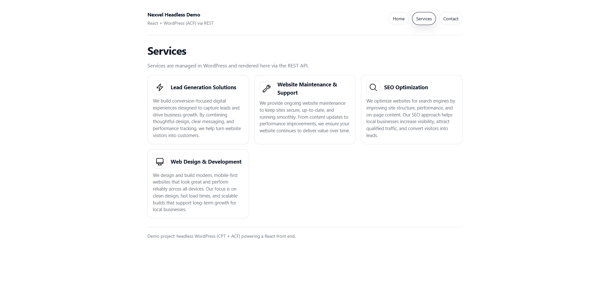
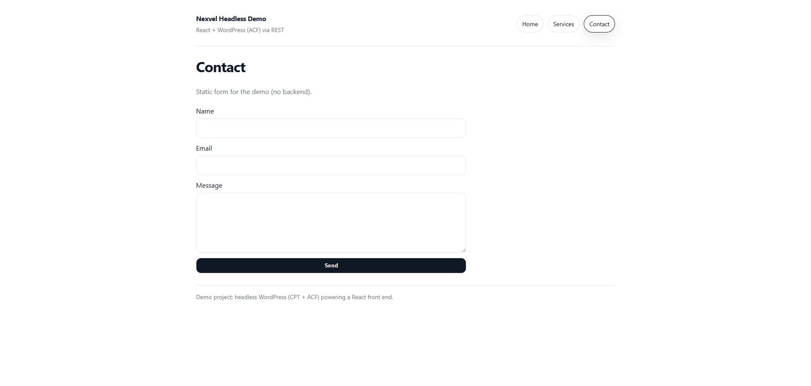

# Nexvel Headless WordPress + React Demo

## Overview

This project demonstrates a **headless WordPress architecture**, using WordPress as a content management system (CMS) and React as the front-end application.

Content is created and managed in WordPress using **Custom Post Types** and **Advanced Custom Fields (ACF)**, exposed via the **WordPress REST API**, and consumed by a modern React front end built with **Vite**.

The goal of this project is to showcase how structured CMS content can power fast, flexible front-end experiences for real-world agency websites.

---

## Screenshots

### Home Page


### Services Page


### Contact Page



---

## Tech Stack

### Backend (CMS)
- WordPress (self-hosted, local)
- Custom Post Type: **Services**
- Advanced Custom Fields (ACF)
- WordPress REST API

### Front End
- React
- Vite
- React Router
- Native Fetch API

---

## Architecture
```
WordPress (Local CMS)
 ├── Custom Post Type (Services)
 ├── ACF Fields (Description, Icon)
 └── REST API (/wp-json/wp/v2/services)
        ↓
React Front End (Vite)
 ├── Fetches CMS data
 ├── Resolves media assets
 ├── Client-side routing
 └── Responsive UI
```


This separation allows:
- Content editors to work independently in WordPress
- Developers to build fast, flexible front-end experiences
- Clean scaling for future features or platforms

---

## Features

- Headless WordPress setup
- Custom content modeling with CPT + ACF
- REST API integration
- Media resolution (attachment IDs → image URLs)
- Loading and error handling states
- Client-side routing:
  - Home
  - Services
  - Contact (static form)
- Mobile-friendly layout

---

## Why Headless WordPress?

Using WordPress as a headless CMS allows teams to:
- Leverage WordPress’s mature content management tools
- Avoid theme constraints
- Build modern, performant front ends with React
- Reuse the same CMS for multiple platforms if needed

This approach is commonly used in agency environments to balance editorial flexibility with modern development workflows.

---

## Running the Project Locally

### Prerequisites
- Node.js (v18+ recommended)
- npm
- Local WordPress environment (e.g., LocalWP)

### React Front End

```bash
cd nexvel-frontend
npm install
npm run dev

The app runs at:
http://localhost:5173

Ensure the WordPress site URL in `src/config.js` matches your local WordPress domain.


> Note: WordPress runs locally as a headless CMS and is not included in this repository. Content is modeled using Custom Post Types and Advanced Custom Fields and exposed via the WordPress REST API.